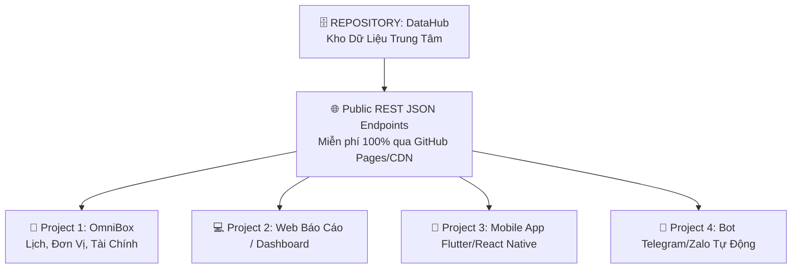

# 🏛️ TÀI LIỆU CẤU TRÚC HỆ THỐNG & BLUEPRINT KIẾN TRÚC
> *Tài liệu chuẩn kiến trúc hệ sinh thái tiện ích & Trung tâm dữ liệu dùng chung (DataHub). Copy file này vào bất kỳ dự án mới nào để tái sử dụng ngay lập tức.*

---

## 📌 1. TỔNG QUAN HỆ SINH THÁI (ECOSYSTEM OVERVIEW)

Hệ thống được thiết kế theo mô hình **Tách biệt Dữ liệu (Data Hub) và Giao diện (Client Apps)**:



---

## 📁 2. CẤU TRÚC THƯ MỤC CHUẨN

### A. Cấu trúc Dự Án Frontend (Ví dụ: `OmniBox`)
```text
OmniBox/
├── index.html               # Cấu trúc giao diện HTML5 Semantic & PWA Meta
├── style.css                # Hệ thống CSS Design System (Glassmorphism, Dark/Light mode)
├── manifest.json            # Cấu hình PWA cài đặt lên màn hình iPhone/Android
├── sw.js                    # Service Worker hỗ trợ chạy Offline
├── apple-touch-icon.png     # Icon 512x512 chuẩn màn hình chính iPhone
├── favicon.png              # Icon trình duyệt
├── data/                    # (Tùy chọn) Bản lưu cache dữ liệu cục bộ
│   ├── gold-latest.json
│   └── gold-history.json
└── js/                      # Các Module chức năng độc lập
    ├── lunar.js             # Thư viện tính Lịch Âm Dương, Can Chi, Giờ Hoàng Đạo
    ├── units.js             # Thư viện quy đổi 9 nhóm đơn vị đo lường
    ├── currency.js          # Thư viện tỷ giá Vietcombank & chuyển đổi ngoại tệ
    ├── gold.js              # Thư viện giá vàng SJC, 9999 & vẽ biểu đồ Chart.js
    └── app.js               # Controller trung tâm kết nối sự kiện, theme và UI
```

---

### B. Cấu trúc Kho Dữ Liệu Trung Tâm (`DataHub`)
```text
DataHub/
├── README.md                # Hướng dẫn sử dụng các Endpoint API
├── .github/
│   └── workflows/
│       └── cron-crawler.yml # Tự động cào dữ liệu lúc 8h30 và 14h30 hàng ngày
├── scripts/                 # Các script Python cào dữ liệu tự động
│   ├── crawl_gold.py        # Cào giá vàng SJC, DOJI, PNJ
│   ├── crawl_exchange.py    # Cào tỷ giá Vietcombank, BIDV
│   └── crawl_petrol.py      # Cào giá xăng dầu Petrolimex
└── api/v1/                  # Cung cấp file JSON công khai (REST Endpoints)
    ├── gold/
    │   ├── latest.json      # Giá vàng mới nhất hôm nay
    │   └── history.json     # Lịch sử giá vàng toàn bộ các ngày qua
    ├── exchange/
    │   ├── latest.json      # Tỷ giá ngoại tệ mới nhất
    │   └── history.json     # Lịch sử tỷ giá ngoại tệ
    └── petrol/
        └── latest.json      # Giá xăng dầu mới nhất
```

---

## 📡 3. ĐỊNH DẠNG DỮ LIỆU CHUẨN (API DATA SCHEMAS)

### 🥇 Schema Giá Vàng (`api/v1/gold/latest.json`)
```json
{
  "updatedAt": "2026-09-04T15:30:00+07:00",
  "updatedDate": "2026-09-04",
  "unit": "triệu đồng / lượng",
  "items": [
    {
      "id": "sjc_hcm",
      "brand": "SJC",
      "name": "Vàng miếng SJC 1L - 10L",
      "buy": 145.60,
      "sell": 148.60,
      "buyPerChi": 14.56,
      "sellPerChi": 14.86,
      "change": 0.20
    },
    {
      "id": "sjc_nhan",
      "brand": "SJC",
      "name": "Vàng nhẫn SJC 99.99 (1-5 chỉ)",
      "buy": 147.50,
      "sell": 150.50,
      "buyPerChi": 14.75,
      "sellPerChi": 15.05,
      "change": 0.30
    }
  ]
}
```

### 📈 Schema Lịch Sử Giá Vàng (`api/v1/gold/history.json`)
```json
[
  {
    "date": "2026-09-01",
    "sjc_buy": 144.50,
    "sjc_sell": 147.50,
    "nhan_buy": 146.20,
    "nhan_sell": 149.20
  },
  {
    "date": "2026-09-04",
    "sjc_buy": 145.60,
    "sjc_sell": 148.60,
    "nhan_buy": 147.50,
    "nhan_sell": 150.50
  }
]
```

### 💵 Schema Tỷ Giá Ngoại Tệ (`api/v1/exchange/latest.json`)
```json
{
  "updatedAt": "2026-09-04T11:00:00+07:00",
  "source": "Vietcombank",
  "items": [
    {
      "code": "USD",
      "name": "US DOLLAR",
      "buy": 25120,
      "transfer": 25150,
      "sell": 25480
    },
    {
      "code": "EUR",
      "name": "EURO",
      "buy": 27100,
      "transfer": 27350,
      "sell": 28550
    }
  ]
}
```

---

## 💻 4. MẪU CODE KẾT NỐI NHANH CHO DỰ ÁN MỚI

### Trong JavaScript / TypeScript / Web App:
```javascript
// Hàm tải dữ liệu dùng chung từ DataHub
async function fetchMarketData(type = "gold") {
  const BASE_URL = "https://fatken13.github.io/DataHub/api/v1";
  try {
    const res = await fetch(`${BASE_URL}/${type}/latest.json`);
    if (!res.ok) throw new Error("Network error");
    const data = await res.json();
    return data;
  } catch (err) {
    console.warn("Lỗi tải online, chuyển sang fallback:", err);
    return null;
  }
}

// Cách dùng:
const goldData = await fetchMarketData("gold");
console.log("Giá SJC hôm nay:", goldData.items[0].sell);
```

### Trong Python (Bot / Backend / Automation):
```python
import urllib.request
import json

url = "https://raw.githubusercontent.com/FatKen13/DataHub/main/api/v1/gold/latest.json"
req = urllib.request.Request(url, headers={'User-Agent': 'Mozilla/5.0'})

with urllib.request.urlopen(req) as response:
    data = json.loads(response.read().decode('utf-8'))
    print("SJC Bán Ra:", data['items'][0]['sell'])
```

---

## ⚙️ 5. MẪU GITHUB ACTIONS TỰ ĐỘNG CHẠY 24/7 (`.github/workflows/crawler.yml`)

```yaml
name: Scheduled DataHub Crawler

on:
  schedule:
    - cron: '30 1 * * *'  # 08:30 sáng (GMT+7)
    - cron: '30 7 * * *'  # 14:30 chiều (GMT+7)
  workflow_dispatch:      # Bấm chạy thủ công

permissions:
  contents: write

jobs:
  crawl:
    runs-on: ubuntu-latest
    steps:
      - name: Checkout Repo
        uses: actions/checkout@v4

      - name: Setup Python
        uses: actions/setup-python@v5
        with:
          python-version: '3.11'

      - name: Run Crawler
        run: python scripts/crawl_all.py

      - name: Commit and Push DB
        run: |
          git config --global user.name "github-actions[bot]"
          git config --global user.email "github-actions[bot]@users.noreply.github.com"
          git add api/
          if git diff --staged --quiet; then
            echo "Dữ liệu không đổi."
          else
            git commit -m "chore(db): cập nhật dữ liệu tự động [skip ci]"
            git push origin main
          fi
```

---

## 🎯 6. DANH SÁCH MODULE TIỆN ÍCH CÓ SẴN ĐỂ COPY DÙNG LẠI

| File Module | Chức năng chính | Cách tái sử dụng |
| :--- | :--- | :--- |
| [`js/lunar.js`](file:///Users/mini/Projects/AntiGravity/MoonCalendar/js/lunar.js) | Tính lịch Âm Dương GMT+7, Can Chi, Tiết Khí, Giờ Hoàng Đạo | `LunarCalendar.getFullDayInfo(new Date())` |
| [`js/units.js`](file:///Users/mini/Projects/AntiGravity/MoonCalendar/js/units.js) | Quy đổi 9 hệ đơn vị (Quốc tế + Sào, Mẫu, Chỉ/Cây vàng) | `UnitConverter.convert(category, from, to, value)` |
| [`js/gold.js`](file:///Users/mini/Projects/AntiGravity/MoonCalendar/js/gold.js) | Bảng giá vàng, tính tiền vàng, vẽ biểu đồ Chart.js | `GoldManager.calculateGoldMoney(amount, unit, type)` |
| [`js/currency.js`](file:///Users/mini/Projects/AntiGravity/MoonCalendar/js/currency.js) | Tỷ giá Vietcombank, vượt CORS, máy tính đổi ngoại tệ | `CurrencyManager.fetchExchangeRates()` |

---

## 🔒 7. KIẾN TRÚC 2 KHO GITHUB: PUBLIC DATAHUB & PRIVATE PERSONAL VAULT

Hệ thống phân định 2 kho dữ liệu riêng biệt trên tài khoản GitHub của bạn:

```mermaid
graph TD
    subgraph RepoPublic[🌐 REPO 1: FatKen13/DataHub (PUBLIC)]
        D1[api/v1/gold/latest.json<br>Giá Vàng SJC, 9999]
        D2[api/v1/exchange/latest.json<br>Tỷ Giá Ngoại Tệ VCB]
        D3[api/v1/petrol/latest.json<br>Giá Xăng Dầu]
    end

    subgraph RepoPrivate[🔒 REPO 2: FatKen13/my-vault (PRIVATE)]
        P1[finance/expenses.json<br>Sổ Thu - Chi Hàng Ngày]
        P2[finance/budgets.json<br>Hạn Mức Chi Tiêu Tháng]
        P3[finance/savings.json<br>Tích Lũy Vàng, Tiết Kiệm]
        P4[reminders/lunar-events.json<br>Sổ Giỗ Chạp, Sinh Nhật Âm]
    end

    RepoPublic -->|GET Miễn phí không cần Token| Apps[📱 OmniBox & Các App Khác]
    Apps <-->|Đọc / Ghi bảo mật qua GitHub PAT| RepoPrivate
```

---

### A. Cấu trúc Kho Dữ Liệu Cá Nhân Riêng Tư (`FatKen13/my-vault` - Chế độ PRIVATE)

```text
my-vault/ (Chế độ PRIVATE - Chỉ tài khoản của bạn xem được)
├── README.md
├── finance/
│   ├── expenses.json        # Danh sách các giao dịch Thu / Chi
│   ├── categories.json      # Danh mục (Ăn uống, Tiền nhà, Mua sắm, Lương...)
│   ├── budgets.json         # Ngân sách giới hạn chi tiêu từng tháng
│   └── savings.json         # Sổ theo dõi tài sản, vàng tích lũy, sổ tiết kiệm
├── reminders/
│   └── lunar-events.json    # Danh sách ngày giỗ, sinh nhật âm lịch gia đình
└── notes/
    └── secure-notes.json    # Ghi chú tài chính cá nhân
```

---

### B. Mẫu Schema Dữ Liệu Thu - Chi Cá Nhân (`finance/expenses.json`)

```json
{
  "currency": "VND",
  "updatedAt": "2026-09-04T15:45:00+07:00",
  "transactions": [
    {
      "id": "tx_1788508800000",
      "date": "2026-09-04",
      "type": "expense", 
      "category": "Ăn uống",
      "amount": 55000,
      "note": "Ăn trưa cơm văn phòng",
      "paymentMethod": "Vietcombank"
    },
    {
      "id": "tx_1788508900000",
      "date": "2026-09-01",
      "type": "income",
      "category": "Lương",
      "amount": 30000000,
      "note": "Lương tháng 8/2026",
      "paymentMethod": "Techcombank"
    }
  ]
}
```

---

### C. Mẫu Schema Sổ Tích Lũy Vàng & Tài Sản (`finance/savings.json`)

```json
{
  "updatedAt": "2026-09-04T15:45:00+07:00",
  "goldHoldings": [
    {
      "id": "gold_1",
      "buyDate": "2025-05-10",
      "type": "SJC",
      "quantityChi": 20,
      "buyPricePerChi": 11.50,
      "note": "Mua tại SJC Nguyễn Thị Minh Khai"
    }
  ],
  "savingsAccounts": [
    {
      "id": "sav_1",
      "bank": "Vietcombank",
      "amount": 100000000,
      "interestRate": 5.5,
      "termMonths": 12,
      "startDate": "2026-01-15"
    }
  ]
}
```

---

### D. Cơ Chế Đọc / Ghi Từ Client Lên Private Repo (Code Mẫu JavaScript)

Ứng dụng client (OmniBox) lưu **GitHub Token (PAT)** trong `localStorage` của trình duyệt cá nhân bạn để thực hiện đọc/ghi dữ liệu bí mật:

```javascript
// js/vault.js - Quản lý đồng bộ kho riêng tư
const VaultManager = {
  OWNER: 'FatKen13',
  REPO: 'my-vault',
  
  getToken() {
    return localStorage.getItem('omnibox_github_pat') || '';
  },

  // 1. Đọc dữ liệu từ Repo Private
  async readData(filePath) {
    const token = this.getToken();
    if (!token) throw new Error('Chưa cấu hình GitHub Token!');

    const res = await fetch(`https://api.github.com/repos/${this.OWNER}/${this.REPO}/contents/${filePath}`, {
      headers: {
        'Authorization': `Bearer ${token}`,
        'Accept': 'application/vnd.github.v3+json'
      }
    });
    
    if (!res.ok) throw new Error(`Lỗi đọc dữ liệu: ${res.statusText}`);
    const data = await res.json();
    const content = decodeURIComponent(escape(atob(data.content)));
    return { content: JSON.parse(content), sha: data.sha };
  },

  // 2. Ghi / Cập nhật dữ liệu vào Repo Private
  async writeData(filePath, newContentObj, sha = null) {
    const token = this.getToken();
    const encodedContent = btoa(unescape(encodeURIComponent(JSON.stringify(newContentObj, null, 2))));

    const payload = {
      message: `update: ${filePath} at ${new Date().toISOString()}`,
      content: encodedContent
    };
    if (sha) payload.sha = sha;

    const res = await fetch(`https://api.github.com/repos/${this.OWNER}/${this.REPO}/contents/${filePath}`, {
      method: 'PUT',
      headers: {
        'Authorization': `Bearer ${token}`,
        'Content-Type': 'application/json'
      },
      body: JSON.stringify(payload)
    });

    return await res.json();
  }
};
```

